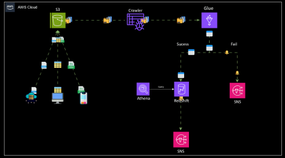

# Enhancing-E-Commerce-Agility-With-Advanced-ETL-Pipeline

You are hired as a Data Engineer for an e-commerce company where the Order and Returns teams regularly upload data files through a Streamlit web application to AWS Data Lake

## Problem Statement:
As a Data Engineer the objective is to build an end-to-end automated data processing workflow that handles data uploads from the Order and Returns teams, performs a join operation using Glue & PySpark, stores the joined data in RDS, and sends notifications about the pipeline's status using SNS.

### Technologies used :
1) AWS Glue
2) pyspark
3) SNS
4) Step Funtion
5) S3
6) RDS
7) EC2
8) Streamlit

## Use case :
### Teams and Data Upload:
The Order and Returns teams use a Streamlit web application tailored to their needs to upload their respective data files.
The Order team uploads "order" data files, while the Returns team uploads "returned" data files.
The Streamlit app ensures secure data transfer and uploads the files to designated S3 buckets for each team.

### Lambda Trigger and Glue ETL:
Set up an AWS Lambda function that's triggered when new files are uploaded to the Order and Returns S3 buckets.
The Lambda function invokes an AWS Glue ETL job to fetch the uploaded data files, perform data transformation using PySpark, and join the datasets based on the "Order ID" column.

### Data Join and RDS:
The Glue ETL job outputs the joined dataset based on “Order ID”, which includes information from both the "order" and "returned" data files.
Store the joined table into RDS and finally team should query the final table by Athena
Learner can implement the same on databricks also (optional).

### AWS Step Functions and Monitoring:
Develop an AWS Step Function to orchestrate the entire workflow.
Monitor the progress of each stage to track the execution status and any failures.
And the team wants to see the success or fails pipeline execution message in streamlit UI

### SNS Notifications:
Configure two subscription endpoints for email notifications
After each execution, send an SNS notification indicating whether the pipeline succeeded or failed.
